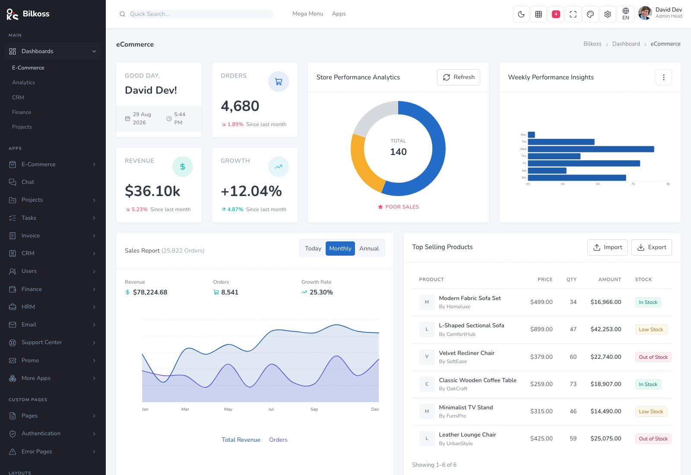
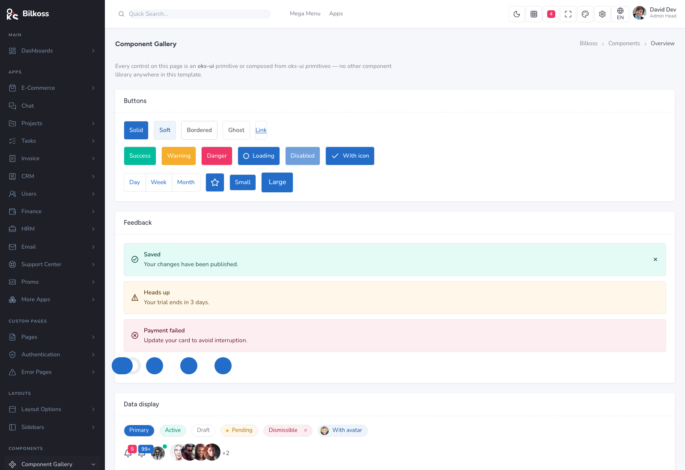
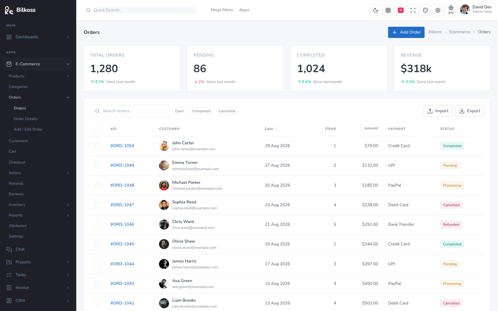

# Bilkoss

**An admin dashboard template built entirely with [oks-ui](https://www.npmjs.com/package/oks-ui).**

Every button, input, chart, menu and table cell is an oks-ui primitive or composed
from oks-ui primitives — no second component library, no second charting library,
no form or data-fetching library anywhere in the source.

- **Live demo:** https://oks-projects.github.io/bilkoss/ · **Repository:** https://github.com/OKS-PROJECTS/bilkoss



## Screenshots

| Dashboard | Component gallery | List view |
| --- | --- | --- |
|  |  |  |

## Stack

- **Vite + React 19**, JavaScript
- **oks-ui** for all UI — primitives, fields, charts
- **Tailwind v4** for layout only (flex / grid / spacing); every colour, radius,
  border and shadow is a CSS variable
- **react-router-dom v7**
- **lucide-react** for icons
- `oxlint` for linting

## Scripts

```bash
npm install
npm run dev       # start the dev server
npm run lint      # oxlint — must be clean
npm run build     # production build
npm run preview   # preview the build
```

## How the `ui/` layer works

`src/Components/ui/` is a thin adapter over oks-ui. Most wrappers (`Surface`,
`DataTable`, `Pagination`, `StatGroup`, `Accordion`, `Timeline`, `BoardView`,
`SegmentedControl`, `MeterList`, `Skeleton`, `EmptyState`, `Breadcrumbs`, …) just
delegate to the matching oks-ui component and keep a stable, template-facing prop
shape; a few (`KpiCard`, `DonutCard`, `Sparkline`, `PageHeader`, `ChartCard`) are
bespoke compositions of oks-ui parts + `--app-*` design tokens. Pages never
hand-roll these — they import from the barrel in `src/Components/ui/index.js`.

Screens that are a list, form, detail, settings panel, board or report are
**config objects** (`src/data/*.jsx`) rendered through a shared archetype page,
not bespoke components.

`src/styles/theme.css` is the single file that makes the whole app look the way it
does — a brand ramp, semantic role colours, and an `--app-*` semantic layer that
light/dark and any rebrand flip together.

## Versioning

The template has its own SemVer, independent of oks-ui's. See
[`CHANGELOG.md`](./CHANGELOG.md) for the compatible oks-ui range.

## License

[MIT](./LICENSE) © OKS-PROJECTS
